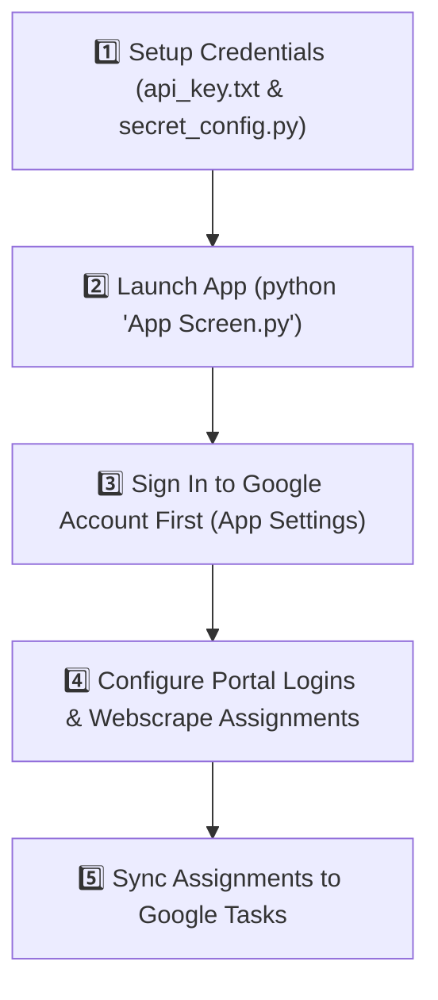

[](https://www.youtube.com/watch?v=Xj08vbPjx4o)

# 🫧 U-Bubble (College Assignment Tracker) 🎓

> **Never lose track of your upcoming college assignments again!** 🚀

---

## 🌟 What is U-Bubble?

**U-Bubble** (short for *University Bubble*) is an automated assignment tracker designed to eliminate the hassle of manually checking multiple educational portals every day. 

Instead of jumping between different sites to remember what homework or quizzes are due, U-Bubble automatically **web scrapes your upcoming assignments** from platforms like Blackboard, ZyBooks, and Cengage/WebAssign and syncs them seamlessly to your **Google Tasks**. 

With U-Bubble, all your deadlines live in one single, organized hub making it easy to stay ahead of course deadlines and check off assignments as you complete them! ✅

---

## 🎯 Who is U-Bubble For?

U-Bubble was built specifically for **college and university students** who:
- 📚 Are enrolled in multiple courses across different online learning portals.
- ⏰ Want a centralized, automated way to track all homework, quizzes, and project deadlines.
- 📱 Use **Google Tasks** or Google Calendar to manage their daily routine and complete assignments on time.
- 💡 Want to spend less time managing deadlines and more time focused on learning!

---

## 🛠 Supported Platforms

- ✅ **Fully/Partially Supported:** Blackboard, Demo integrations
- 🔄 **In Progress:** ZyBooks, WebAssign/Cengage (Expanded Support)

---

## 🚀 How to Use U-Bubble (Day-to-Day Workflow)

Using U-Bubble as your daily assignment hub is fast and automated. Once your accounts and portals are configured, here is how U-Bubble fits into your daily student routine:

1. **📱 Open U-Bubble & Launch Scraper:**
   - Launch the U-Bubble app before starting your study session or at the beginning of your week.
   - Click **Scrape Assignments** to automatically log into your added course portals (Blackboard, ZyBooks, Cengage, etc.).

2. **🤖 Automated AI Processing:**
   - U-Bubble extracts assignment titles, quizzes, projects, and due dates directly from the web pages using AI—saving you from clicking around multiple portals to find due dates.

3. **📅 Sync Directly to Google Tasks:**
   - Click **Send to Google Tasks** to push all scraped deadlines directly into your Google Tasks / Google Calendar account.

4. **✅ Track & Cross Off Assignments:**
   - View your upcoming deadlines on your phone, tablet, or laptop via the Google Tasks app, and check them off as you complete your work! 🎯

---

## 🔑 Open Source & Credentials Notice

> [!NOTE]
> **This repository is an open-source release.** For security reasons, pre-configured API keys and Google Cloud client secrets are **not included** in this project. 

To bridge this gap and run U-Bubble locally with full AI and Google Tasks integration, developers and contributors will need to supply their own credentials.

### 🛠 How to Configure Your Credentials

#### 1. 🤖 Gemini API Key (For AI Assignment Extraction)
- Get a free Gemini API key from [Google AI Studio](https://aistudio.google.com/).
- Create a file named `api_key.txt` in the root directory of the project.
- Paste your API key directly into `api_key.txt`:
  ```text
  YOUR_GEMINI_API_KEY_HERE
  ```
  *(Alternatively, you can save your key via the in-app settings screen!)*

#### 2. 🔐 Google Cloud Credentials (For Google Tasks Syncing)
- Go to the [Google Cloud Console](https://console.cloud.google.com/).
- Create a new project (or select an existing one) and enable the **Google Tasks API**.
- Create an **OAuth 2.0 Client ID** credential (Application type: *Desktop App*).
- Create a file named `secret_config.py` in the root directory and populate it with your client details:
  ```python
  CLIENT_CONFIG = {
      "installed": {
          "client_id": "YOUR_CLIENT_ID.apps.googleusercontent.com",
          "project_id": "YOUR_PROJECT_ID",
          "auth_uri": "https://accounts.google.com/o/oauth2/auth",
          "token_uri": "https://oauth2.googleapis.com/token",
          "auth_provider_x509_cert_url": "https://www.googleapis.com/oauth2/v1/certs",
          "client_secret": "YOUR_CLIENT_SECRET",
          "redirect_uris": ["http://localhost"]
      }
  }
  ```
- On your first run, U-Bubble will prompt you to authenticate in your browser and will automatically create `token.json` for future sessions.

---

## 💻 Setup & Installation Guide

Follow these step-by-step instructions to get U-Bubble running in **VS Code**, **PyCharm**, or any Python-compatible IDE.

### 1. 📋 Prerequisites
- **Python 3.9 - 3.11** installed on your system.
- **Git** installed.

### 2. 📥 Clone the Repository & Open IDE
Open your terminal (or IDE terminal in VS Code / PyCharm) and navigate to your project directory:
```bash
git clone https://github.com/tommorowtime/U-Bubble.git
cd U-Bubble
```

### 3. 🐍 Set Up Virtual Environment (Recommended)
Creating a virtual environment ensures clean, isolated package management:

**Windows (PowerShell / Command Prompt):**
```bash
python -m venv .venv
.\.venv\Scripts\activate
```

**macOS / Linux:**
```bash
python3 -m venv .venv
source .venv/bin/activate
```

### 4. 📦 Install Dependencies
Copy and paste this single command to install all required libraries from `requirements.txt`:
```bash
pip install -r requirements.txt
```

---

## 🚦 Recommended Chronological Workflow

To ensure seamless integration without missing credentials or connection errors, follow this exact sequence when opening U-Bubble for the first time:



1. **Configure Credentials First:** Fill out `api_key.txt` and `secret_config.py` as detailed in the [Open Source Credentials Notice](#-open-source--credentials-notice).
2. **Launch the Application:**
   Run the main application script in your terminal:
   ```bash
   python "App Screen.py"
   ```
3. **🔑 Sign In First (Crucial Step):**
   - Once the UI opens, go immediately to **Settings / Sign In**.
   - Authenticate your Google account to connect Google Tasks OAuth right away. Doing this first ensures all webscraped assignments will sync without authentication interrupts!
4. **Scrape & Sync:** Add your course portals, scrape your assignments, and push them to Google Tasks! 🚀

---

## 🧪 Demo Mode Guide (Test Without Real School Portals)

If you are not currently a student, or if you don't have access to active coursework and just want to test how U-Bubble automatically scrapes assignments and sends them to Google Tasks, you can use the built-in **Demo Mode**! 🎮

*(This exact demonstration workflow is also showcased in the demo video at the top of this README!)* 🎥

### 📝 Step-by-Step Demo Setup:

1. **🔑 Step 1: Add Demo Account Credentials in Settings**
   - Open **Settings** in the U-Bubble app.
   - Enter the following demo credentials:
     - **Username:** `username`
     - **Password:** `password`
   - Save your credentials.

2. **➕ Step 2: Create a Class Item**
   - Navigate to the **Classes** screen to add a new class item.
   - Set the parameters as follows:
     - **Class Name:** *(Can be anything, e.g., "Demo Computer Science")*
     - **Web Name:** `demo` *(⚠️ MUST be set to `demo` exactly for the web scraper to select the correct scraping logic!)*
     - **Portal Link:** `https://tommorowtime.github.io/U-Bubble/`
   
   > 💡 **Note on Web Names:** Just like `demo` must be exact, other platforms require their respective exact web names (e.g., `blackboard` for Blackboard). You can also visit [https://tommorowtime.github.io/U-Bubble/](https://tommorowtime.github.io/U-Bubble/) directly in your browser using `username` / `password` to view the hosted demo site yourself!

3. **🕷 Step 3: Run the Web Scraper**
   - Click the **Scrape Assignments** button.
   - U-Bubble will launch an automated browser session, log into the demo portal, scrape sample assignments, and extract titles and due dates using AI.

4. **✅ Step 4: Sync to Google Tasks**
   - Click **Send to Google Tasks**!
   - Open your Google Tasks app or Google Calendar to see your brand-new demo assignments populated and ready to be checked off! 🥳

---

## 🐛 Troubleshooting & Known Tips

> [!TIP]
> Here are common issues and quick fixes when developing or running U-Bubble locally:

| Issue / Error | Cause | Solution |
| :--- | :--- | :--- |
| **`ValueError: CLIENT_CONFIG is missing`** | `secret_config.py` is not created or empty. | Create `secret_config.py` with your Google Cloud OAuth Client ID & Secret (see guide above). |
| **`WARNING: Gemini API key not found`** | `api_key.txt` missing or empty. | Add your key to `api_key.txt` or paste it in the app's settings menu. |
| **Kivy / KivyMD GUI window fails to launch** | Missing system OpenGL driver or incorrect Python version. | Ensure Python version is 3.9–3.11 and display drivers are up to date. |
| **Selenium WebDriver Error** | Chrome browser version mismatch. | Ensure Google Chrome is updated; Selenium will manage ChromeDriver automatically. |
| **Google Auth browser window doesn't open** | Default browser not set or local server blocked on port 0. | Check terminal output for the OAuth URL and manually paste it into your browser. |

---

## 🛡️ Fallback Functionality: Web Scraping Without API Keys

Don't have a Gemini API key or Google Cloud OAuth setup yet? **No problem!** 

U-Bubble is engineered with a **robust fallback mode**. Even without external API keys or OAuth credentials, the base desktop app remains fully functional for web scraping.

### 🌐 How Fallback Scraping Works:
Provided you log into your course website through U-Bubble, the app's automated Selenium scraper will still:
1. Access your student portal.
2. Extract all raw assignment text, titles, due dates, and page information.
3. Store the scraped data locally in U-Bubble.

### 📋 Copying Raw Scraped Text:
Inside the U-Bubble UI, you can easily copy the extracted raw assignment text to your clipboard with a single click!

```text
[ Scraped Output Clipboard Copy ] ➡️ Ready to paste anywhere!
```

### 💡 What You Can Do With Copied Raw Text:
You can paste this raw text into **any external tool** to build your own custom workflows:

1. **🤖 Custom AI Prompts (ChatGPT, Claude, Gemini Web, DeepSeek):**
   Paste the raw text into any web LLM with a prompt like:
   > *"Here is raw text from my college portal. Format this into a bulleted list of assignments sorted by due date and course name:"*
   ```text
   [Paste U-Bubble Scraped Raw Text Here]
   ```

2. **📋 Custom Gems & ChatGPT GPTs:**
   Use the custom Gem instructions detailed in the [How to Use section](#-how-to-use-u-bubble) to automatically structure your assignments and generate custom task lists.

3. **📱 Alternative Task Managers & Productivity Apps:**
   Paste formatted deadlines into **Notion**, **Todoist**, **TickTick**, **Apple Reminders**, or **Trello** to manage your workflow your way!

---

## 📦 Packaging & Distribution (PyInstaller)

Want to share U-Bubble with non-CS friends who just want an easy click-and-run app without setting up Python or a terminal? You can easily bundle U-Bubble into a standalone `.exe` executable using **PyInstaller**! 🎁

### 🔨 How to Build a Standalone `.exe`
1. Install PyInstaller in your active environment:
   ```bash
   pip install pyinstaller
   ```
2. Build the app using the existing `UBubble.spec` configuration (or generate a clean build):
   ```bash
   pyinstaller UBubble.spec
   ```
   *(Or run directly on the main entry point:)*
   ```bash
   pyinstaller --noconfirm --onedir --windowed "App Screen.py"
   ```
3. Find your ready-to-use application inside the generated `dist/` folder! You can zip this folder up and share it with friends so they can run U-Bubble directly! 🚀

---

## 🤝 Contributing & Community Vision

U-Bubble was created with a mission to make student life easier and stress-free. We strongly encourage **CS students and open-source developers** to fork this project and contribute! 💡

### 🌟 Ways You Can Help Grow U-Bubble:
- 🌐 **Add Support for New Portals:** Add web scraping support for platforms like Canvas, Moodle, Edgenuity, McGraw Hill, and more!
- 🤝 **User-Friendly Access:** Help make setup even more seamless so non-technical students can effortlessly track their coursework.
- 🎨 **UI & Feature Improvements:** Enhance the interface, add desktop notifications, or improve sorting options.

*Let's build an open, accessible tool that helps every college student stay on top of their goals!* 🎓✨

---

## 💬 Community, Feedback & Work in Progress

> [!IMPORTANT]
> **U-Bubble is an active work in progress!** 🛠️ 
> New features, expanded platform support, and optimizations are continuously being added.

### 📬 We'd Love Your Input!
Got feedback, feature ideas, or ran into a bug? Your contributions and insights make U-Bubble better for everyone:

- 🐛 **Report a Bug:** Encountered an issue or a broken scraper? Please open a [GitHub Issue](https://github.com/tommorowtime/U-Bubble/issues) with steps to reproduce it!
- 💡 **Feature Requests & Suggestions:** Have an idea for a cool feature or an educational website you'd like supported? Submit a feature request via issues or start a discussion!
- ⭐ **Show Your Support:** If U-Bubble helped you stay on top of your assignments, give the repository a star! 🌟

---

## ⚠️ Important Disclaimer & Usage Note

> [!WARNING]
> **U-Bubble is designed as a convenience tool, NOT a replacement for checking your official course portals!**

Please keep the following in mind while using U-Bubble:
- 🌐 **Evolving Web Interfaces & APIs:** Educational portals change their layout frequently, and external APIs (such as Gemini or Google Tasks) may occasionally undergo service updates or rate limits.
- 📌 **Non-Standard Assignment Formats:** Instructors sometimes post assignments inside downloadable PowerPoint slides, syllabus files, embedded PDF announcements, or non-standard subfolders that web scrapers cannot automatically parse.
- 💡 **Always Double-Check Your Course Portals:** U-Bubble is meant to bring all your deadlines together into one easy hub for convenience, but you should **still check your official course websites directly** (after class, weekly, or before major deadlines) to ensure you never miss an assignment.


